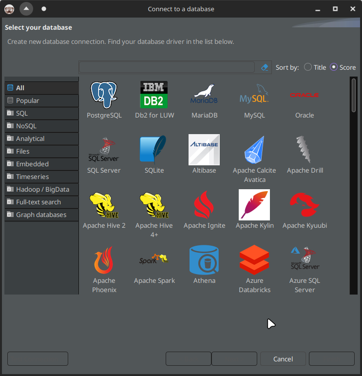
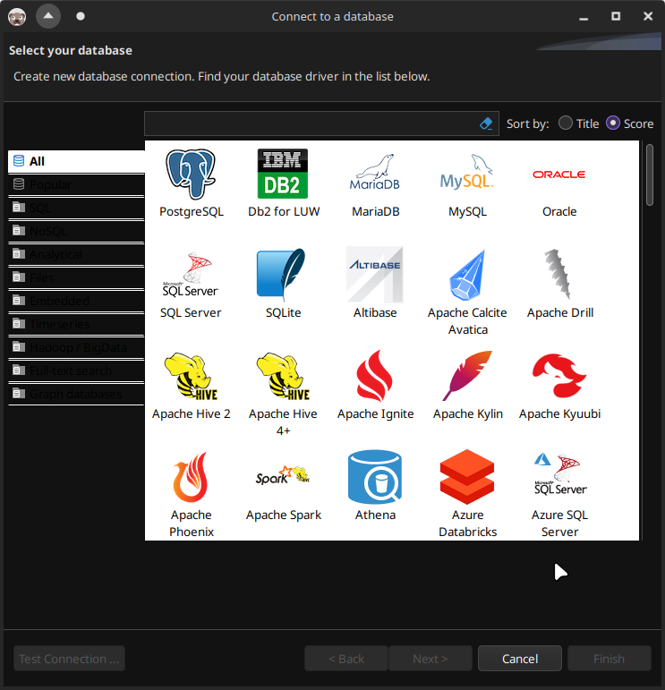

# dbeaver-dark-theme

## 1. Description

CSS files for dark theme in DBeaver to be used with Breeze theme in KDE Plasma.

Dbeaver has bad dark theme integration in KDE Plasma. If you apply default DBeaver's theme, you will get missing button names:



And if you disable themes entirely, you will get unreadable list items:



So, the point of these CSS files is to replace default DBeaver theme, which are stored in:

```sh
ls -al /usr/lib/dbeaver/plugins/org.eclipse.ui.themes*/css
```

## 2. Requirements

- DBeaver already installed.

## 3. Usage

### 3.1. Install

1. Clone this repository to some directory (it will store backup files too, so you probably want to keep it);
2. `cd` to it;
3. Run:

    ```sh
    ./dbeaver_dark_theme.sh install
    ```

    After that, backup of the default theme will be created inside repository directory (it is ignored in GIT).

### 3.2. Uninstall

1. `cd` to cloned repository;
2. Run:

    ```sh
    ./dbeaver_dark_theme.sh uninstall
    ```

3. Remove cloned repository.

## 4. Contribution

I tested these scripts on Arch Linux. On other systems, maybe scripts need to be modified slightly.

Feel free to contribute via [pull requests](https://github.com/Nikolai2038/dbeaver-dark-theme/pulls) or [issues](https://github.com/Nikolai2038/dbeaver-dark-theme/issues)!
