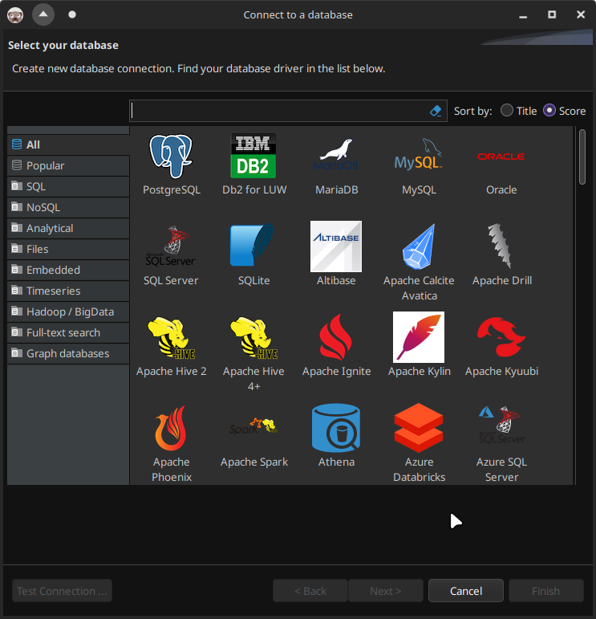

# dbeaver-dark-theme

## 1. Description

This is fix for dark theme in DBeaver to be used with system dark theme (tested on Arch Linux KDE with Dark Breeze theme).

Dbeaver has bad dark theme integration in KDE Plasma. If you apply default DBeaver's theme, you will get missing button names:


And if you disable themes entirely, you will get unreadable list items:


So, the point of these CSS files is to replace default DBeaver theme, which are stored in:

```sh
ls -al /usr/lib/dbeaver/plugins/org.eclipse.ui.themes*/css
```

It turns out, only one file is responsible for unreadable items above (on the second screenshot). And this is `./dark/e4-dark_preferencestyle.css`. So if we remove all other files as [suggested on ArchWiki](https://wiki.archlinux.org/title/Eclipse#Dark_theme), but keep this one, we will get decent result from both worlds:



## 2. Requirements

- DBeaver already installed.

## 3. Install

1. Clone this repository to some directory (it will store backup files too, so you probably want to keep it);
2. `cd` to it;
3. Run:

    ```sh
    ./dbeaver_dark_theme.sh install
    ```

    After that, backup of the default theme will be created inside repository directory (it is ignored in GIT).

4. Start/Restart DBeaver.

## 4. Uninstall

1. `cd` to cloned repository;
2. Run:

    ```sh
    ./dbeaver_dark_theme.sh uninstall
    ```

3. Remove cloned repository;
4. Start/Restart DBeaver.

## 5. Contribution

I tested this script on Arch Linux. On other systems, scripts maybe need to be modified slightly.

Feel free to contribute via [pull requests](https://github.com/Nikolai2038/dbeaver-dark-theme/pulls) or [issues](https://github.com/Nikolai2038/dbeaver-dark-theme/issues)!
