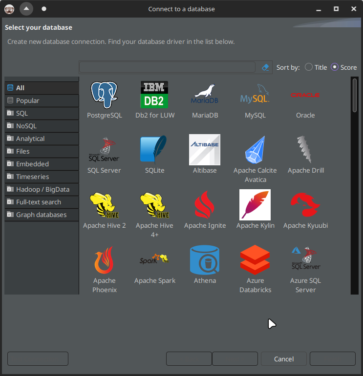

# dbeaver-dark-theme

[EN](README.md) | **RU**

## 1. Описание

Это исправление для тёмной темы в DBeaver, которое используется вместе с системной тёмной темой (протестировано на Arch Linux в KDE Plasma с темой Dark Breeze).

У DBeaver плохая интеграция с тёмной темой в KDE Plasma. Если использовать тему DBeaver по умолчанию, то в некоторых кнопках будет отсутствовать текст:



Если же полностью убрать использование темы DBeaver, то некоторые списки станут нечитабельными:


Поэтому, цель этих CSS-файлов - заменить тему по умолчанию DBeaver, которая хранится в:

```sh
ls -al /usr/lib/dbeaver/plugins/org.eclipse.ui.themes*/css
```

Оказывается, только один файл отвечает за нечитабельные списки выше (на втором скриншоте). Это файл `./dark/e4-dark_preferencestyle.css`. Поэтому если мы удалим все остальные файлы темы, как [предлагается на ArchWiki](https://wiki.archlinux.org/title/Eclipse#Dark_theme), но оставим этот файл, то получим золотую середину:


## 2. Требования

- DBeaver должен быть уже установлен.

## 3. Установка

1. Склонируйте этот репозиторий в какую-нибудь директорию (она также будет содержать файлы резервной копии, так что скорее всего вы не будете её удалять);
2. Перейдите в склонированный репозиторий при помощи команды `cd`;
3. Выполните:

    ```sh
    ./dbeaver_dark_theme.sh install
    ```

    После этого, резервная копия темы по умолчанию будет создана в папке репозитория (она игнорируется в GIT).

4. Запустите/Перезапустите DBeaver.

## 4. Удаление

1. Перейдите в склонированный репозиторий при помощи команды `cd`;
2. Выполните:

    ```sh
    ./dbeaver_dark_theme.sh uninstall
    ```

3. Удалите склонированный репозиторий;
4. Запустите/Перезапустите DBeaver.

## 5. Развитие

Я тестировал эти скрипты на Arch Linux. На других системах, вероятно, нужно будет слегка модифицировать скрипты.

Не стесняйтесь участвовать в развитии репозитория, используя [pull requests](https://github.com/Nikolai2038/dbeaver-dark-theme/pulls) или [issues](https://github.com/Nikolai2038/dbeaver-dark-theme/issues)!
